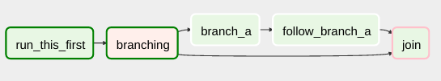

# 概念

Airflow平台是一个用于描述、执行和监控工作流的工具。

### 核心概念

#### 有向无环图（DAGs）

在Airflow中，一个`DAG`——或者说有向无环图（Directed Acyclic Graph）——是你想要运行的所有任务集合，以一种能反映它们的关系和依赖的方式组织在一起。

例如，一个简单的DAG可以由三个任务组成：A，B和C。可以让任务A运行成功后任务B才能运行，而任务C可以在任何时候运行。可以让任务A运行5分钟后超时，以及任务B若失败了能最多重启5次。也可以让工作流在每晚10点运行，但直至某个日期才启动。

这样，一个DAG描述了你希望_如何_执行你的工作流；但是注意一下，我们从未说过我们真正想做_什么_！A，B和C可以是任何事。可能A是准备数据给B分析，而C是发送邮件。也可能A是监控你的位置，这样B可以打开你的车库门，而C是打开你家的灯。重要的事情是，DAG不关心它的组成任务是做什么的；它的工作是确保任务要做的事情发生在正确的时间，或正确的顺序，或能够正确地处理异常问题。

DAG由标准的Python文件所定义，被放置在Airflow的`DAG_FOLDER`文件夹。Airflow会执行每个文件的代码，动态地构建`DAG`对象。你可以拥有任意数量的DAG，每个DAG可以描述任意数量的任务。一般来说，每个DAG应当对应单个逻辑工作流。


搜寻DAG时，Airflow只会考虑那些内容中同时出现了字符串“airflow”和“DAG”的`.py`文件。


### 作用域（Scope）

Airflow会加载任何能从DAG文件导入的`DAG`对象。这就要求DAG必须存在于`globals()`中。考虑下列两个DAG。只有dag\_1会被加载；另一个只会出现在局部作用域（local scope）。

```python
dag_1 = DAG('this_dag_will_be_discovered')

def my_function():
    dag_2 = DAG('but_this_dag_will_not')

my_function()
```

有时候这可以派上用场。例如，SubDagOperator的一个通用模式是定义方法中的子dag，使得Airflow不会试图将它当成独立的DAG进行加载。

### 默认参数（Default Arguments）

如果一个`default_args`字典传递给了DAG，就会被应用到该DAG的所有operator中。这样一个共同的参数可以应用到多个operator，而不必多次输入。

```python
default_args = {
    'start_date': datetime(2016, 1, 1),
    'owner': 'Airflow'
}

dag = DAG('my_dag', default_args=default_args)
op = DummyOperator(task_id='dummy', dag=dag)
print(op.owner) # Airflow
```

### 上下文管理器（Context Managers）

_Airflow 1.8中新增_

DAG可以用作上下文管理器，自动分配新的operator给那个DAG。

```python
with DAG('my_dag', start_date=datetime(2016, 1, 1)) as dag:
    op = DummyOperator('op')

op.dag is dag # True
```

### 操作（Operators）

DAG描述如何运行一个工作流，`Operators`则决定实际做什么。

一个operator描述了一个工作流中的一个单独的任务。Operator们通常（并非总是）是原子的，即它们是独立存在的，不需要与其他operator分享资源。DAG会确保operator们以正确的顺序运行；与那些依赖项不同，operator们通常独立运行。事实上，它们可能运行在两个完全不同的机器上。

这是一个微妙但非常重要的点：一般而言，如果两个operator需要共享信息，如一个文件名或少量数据，你应考虑将它们结合成一个单独的operator。如果分开绝不能避免，Airflow也有一个特性名为XCom，可供operator们交叉通信，本文档的其他部分对其进行了描述。

Airflow提供了很多operator，应付许多常用的任务，包括：

* `BashOperator`- 执行一个bash命令
* `PythonOperator`- 调用任意Python方法
* `EmailOperator`- 发送一封邮件
* `SimpleHttpOperator`- 发送一个HTTP请求
* `MySqlOperator`, `SqliteOperator`, `PostgresOperator`, `MsSqlOperator`, `OracleOperator`, `JdbcOperator`等 - 执行一个SQL命令
* `Sensor`- 等待某个时间、文件、数据库行记录、S3 key等

除了这些基本构件之外，还有超多特定的operator：`DockerOperator`, `HiveOperator`, `S3FileTransformOperator`, `PrestoToMysqlOperator`, `SlackOperator`……你懂的！

`airflow/contrib/`目录包含了更多由社区产生的operator。这些operator并不总是像主要发行版本里的operator那样完整和充分测试，但是方便了用户给平台添加新的功能。

只有当operator分配给了DAG，Airflow才会加载它们。

访问[使用Operator](https://airflow.apache.org/howto/operator.html)查看如何使用Airflow operators。

### DAG分配（DAG Assignment）

_Airflow 1.8中新增_

Operators不用立即分配给DAGs（先前`dag`是个必需的参数）。然而，一旦一个operator分配给了一个DAG，它便不能被传递或未被赋值。DAG分配可以在创建operator时通过延迟分配甚至从其他operator推断的方式显式完成。

```python
dag = DAG('my_dag', start_date=datetime(2016, 1, 1))

# sets the DAG explicitly
explicit_op = DummyOperator(task_id='op1', dag=dag)

# deferred DAG assignment
deferred_op = DummyOperator(task_id='op2')
deferred_op.dag = dag

# inferred DAG assignment (linked operators must be in the same DAG)
inferred_op = DummyOperator(task_id='op3')
inferred_op.set_upstream(deferred_op)
```

### 位移组合（**Bitshift Composition**）

_Airflow 1.8中新增_

operator关系历来由`set_upstream()`和`set_downstream()`方法进行设置。Airflow 1.8中，operator关系可以靠Python位移操作符`>>`和`<<`来设置。下列四条语句在功能上是等同的：

```python
op1 >> op2
op1.set_downstream(op2)

op2 << op1
op2.set_upstream(op1)
```

使用位移来组织operator时，它们的方向由位移操作符所指向的方向决定。例如，`op1 >> op2`表示先运行`op1`后运行`op2`。多个operator也能组成在一起——记住执行链是从左至右执行的，而且最右的对象总是会返回。例如：

```python
op1 >> op2 >> op3 << op4
```

等同于：

```python
op1.set_downstream(op2)
op2.set_downstream(op3)
op3.set_upstream(op4)
```

方便起见，DAG也能使用位移操作符。例如：

```python
dag >> op1 >> op2
```

等同于：

```python
op1.dag = dag
op1.set_downstream(op2)
```

我们可以把它放到一起建立一个简单的pipeline：

```python
with DAG('my_dag', start_date=datetime(2016, 1, 1)) as dag:
    (
        DummyOperator(task_id='dummy_1')
        >> BashOperator(
            task_id='bash_1',
            bash_command='echo "HELLO!"')
        >> PythonOperator(
            task_id='python_1',
            python_callable=lambda: print("GOODBYE!"))
    )
```

### 任务（Tasks）

一旦一个operator被实例化了，它就可以被称作“任务”。这个实例为调用抽象的operator定义了明确的值，参数化的任务就成了DAG的一个节点。

### 任务实例（Task Instances）

一个任务实例代表一个任务的具体运行，是dag、任务和时间点的结合。任务实例也有指示状态，如“running”、“success”、“failed”、“skipped”、“up for retry”等。

### 工作流（Workflows）

现在你已经熟悉了Airflow的核心构件。虽然一些概念可能听上去非常相似，但是这些词汇像这样概念化：

* 有向无环图（DAG）：对工作发生顺序的描述
* 操作（Operator）：充当执行某些工作的模板的类
* 任务（Task）：operator的参数化实例
* 任务实例（Task Instance）：（1）分配给DAG以及（2）有与具体DAG运行有关的状态的任务

通过结合`DAGs`和`Operators`来创建`TaskInstances`，你可以建立复杂的工作流。

### 附加功能

除了核心的Airflow对象，还有大量更为复杂的特性，能够实现诸如限制对资源的同时访问、交叉通信、条件执行等等的行为。

#### 钩子（Hooks）

hooks是外部平台和数据库（如Hive、S3、MySQL、Postgres、HDFS和Pig）的接口。hooks在可能的情况下实现了一个通用接口，并充当operators的构件。它们也使用`airflow.models.Connection`模型来检索主机名和身份验证信息。hooks将认证代码和信息保存在pipeline之外，集中于元数据库。

Hooks本身也十分有用，可以在Python脚本、Airflow  airflow.operators.PythonOperator和诸如iPython或Jupyter Notebook之类的交互环境中使用。

#### 池（Pools）

当太多进程同时冲击时，有些系统会不堪重负。Airflow池可以限制任意任务集合的执行并行度。池列表可在用户界面（`Menu -> Admin -> Pools`）进行管理，方法是赋予池名称，分配给它们一些工作槽。任务创建（即实例化operators）时，使用`pool`参数可将任务与其中一个现有池关联。

```python
aggregate_db_message_job = BashOperator(
    task_id='aggregate_db_message_job',
    execution_timeout=timedelta(hours=3),
    pool='ep_data_pipeline_db_msg_agg',
    bash_command=aggregate_db_message_job_cmd,
    dag=dag)
aggregate_db_message_job.set_upstream(wait_for_empty_queue)
```

`pool`参数可与`priority_weight`结合使用，决定队列中的优先级以及池中的工作槽打开时哪个任务最先执行。默认的`priority_weight`是`1`，可以被改成任意数字。将队列排序来评估下个执行任务时，我们会用到`priority_weight`，我们将该任务的所有下游任务的`priority_weight`值相加。你可以用这种方法抽出一个特定的重要任务，相应地，到达该任务的整个路径也会获得优先顺序。

当工作槽填满时，任务会被如常调用。一旦容量到达极点，可运行的任务进入队列，它们的状态也会显示在用户界面上。随着工作槽释放，队列中的任务会根据（任务及其下游任务）的`priority_weight`启动运行。

注意，默认情况下任务不会被分配给任何池，它们的执行并行度仅受执行器（executor）的设置的限制。

#### 连接（Connections）

与外部系统的连接信息保存在Airflow的元数据库中，并可在用户界面进行管理（`Menu -> Admin -> Connections`）。用户界面上可定义一个`conn_id`，以及附带的主机名/登录名/密码/模式信息。Airflow pipeline只需引用集中管理的`conn_id`，而无需在任何地方硬编码这些信息。

也可定义许多具有相同`conn_id`的连接，这种情况下，当hooks使用`Basehook`的`get_connection`方法时，Airflow会随机选择一个连接，当与重试机制结合时，还会允许一些基本的负载均衡和容错。

很多hooks已经设定默认的`conn_id`，这样operator使用该hook时，不需指明连接ID。例如，[`PostgresHook`](https://airflow.apache.org/code.html#airflow.hooks.postgres_hook.PostgresHook)的默认`conn_id`是`postgres_default`。

访问[管理连接](https://airflow.apache.org/howto/manage-connections.html)获取关于如何创建和管理连接的信息。

#### 队列（Queues）

使用CeleryExecutor时，可以指定任务送达的Celery队列。`queue`是BaseOperator的属性，所以任意任务可以分配给任意队列。环境中的默认队列可以在`airflow.cfg`的`celery -> default_queue`一项中定义。该配置定义了未指明时任务被分配到的队列，也定义了启动时Airflow节点应监听哪个队列。

节点可以监听一个或多个任务队列。一个节点启动时（使用命令`airflow worker`），可以指明队列名，多个队列名用逗号隔开（如，`airflow worker -q spark`）。然后节点只会提取指定队列的任务。

如果你需要专用节点，那这一点就变得挺有用，不管是从资源角度考虑（比如说非常轻量的任务，一个节点就能毫无问题地处理上千个该类任务），还是从环境角度考虑（你想要一个本身运行着Spark集群的节点，因为它需要非常独特的环境和安全权限）。

#### XComs

XComs能让任务之间交换消息，更多的细微的控制形式和分享状态。XComs时“cross-communication”的缩写。XComs主要由主键、值和时间戳定义，但是也可以跟踪一些属性，诸如任务/DAG之类创建了XCom并需可见的属性。任何能够pickled的对象都可以用作XCom值，因此，用户应该确保对象具有合适的大小。

XComs可以被“推送”（发送）或“拉取”（接收）。当一个任务推送了一个XCom，其他任务都可以获取它。任务可以通过调用`xcom_push()`方法在任意时候推送XComs。此外，如果一个任务返回了一个值（来自Oprator的`execute()`方法或来自PythonOperator的`python_callable()`方法），那么就会自动推送包含了该值的XCom。

任务调用`xcom_pull()`取得XComs，选择性地根据诸如`key`、源`task_ids`和源`dag_id`等标准应用过滤器。默认情况下，`xcom_pull()`过滤那些从执行函数返回时自动给予XCom的key（与手动推送的XComs相反）。

如果是将单独的`task_ids`语句传递给`xcom_pull`，那么会返回该任务最近的XCom值；如果是将`task_ids`列表传递给`xcom_pull`，那么会返回相应的XCom值列表。

```python
# inside a PythonOperator called 'pushing_task'
def push_function():
    return value

# inside another PythonOperator where provide_context=True
def pull_function(**context):
    value = context['task_instance'].xcom_pull(task_ids='pushing_task')
```

也有可能是在模板中拉取XCom，下面是一个例子：

```python
SELECT * FROM {{ task_instance.xcom_pull(task_ids='foo', key='table_name') }}
```

注意，XCom与[变量（Variables](https://airflow.apache.org/concepts.html#variables)[）](https://airflow.apache.org/concepts.html#variables)类似，但是XCom是为任务间通信专门设计的，而非用于全局设置。

#### 变量（Variables）

变量是用来存储和获取任意内容或设置的通用方式，以简单的键值形式存储在Airflow中。可以通过用户界面（`Admin -> Variables`）、代码或命令行界面罗列、创建、更新和删除变量。此外，json格式的配置文件可以通过用户界面批量上传。当虽然你的pipeline代码和大部分常量与变量应在代码中定义并由源码控制，但是通过用户界面访问和修改某些变量或配置项可能会排上用场。

```python
from airflow.models import Variable
foo = Variable.get("foo")
bar = Variable.get("bar", deserialize_json=True)
```

第二次调用是假设它是json内容，被反序列化成bar。注意Variable是sqlalchemy数据模型，可以被这样折腾。

你可以通过下面句法使用来自jinja模板的变量：

```python
echo {{ var.value.<variable_name> }}
```

或者，如果你需要从变量反序列化json对象：

```python
echo {{ var.json.<variable_name> }}
```

#### 分支（Branching）

有时候你需要工作流产生分支，或者根据上游任务的触发条件走特定的路径。一个解决方法是使用`BranchPythonOperator`。

`BranchPythonOperator`与PythonOperator非常相似，但是前者的python回调函数可以返回task\_id。下游的路径跟随返回的task\_id，其他的路径都会被跳过。Python函数返回的task\_id引用的是BranchPythonOperator任务的直接下游任务。

注意，使用设置了`depends_on_past=True`的`BranchPythonOperator`下游任务在逻辑上是合理的，因为`skipped`状态导致依赖过去成功的任务会出现阻塞。若所有直接上游任务为`skipped`状态，那该任务的状态也会是`skipped`。

如果你想跳过某些任务，记住你不能设置空路径，如果有空路径，那么就设一个假任务。

可以像这样，假任务“ branch\_false”会被跳过


不可像这样，join任务会被跳过



