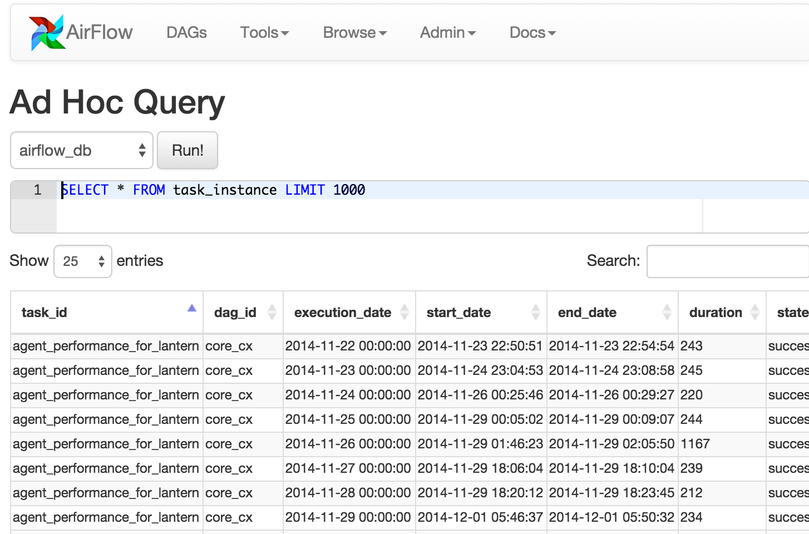
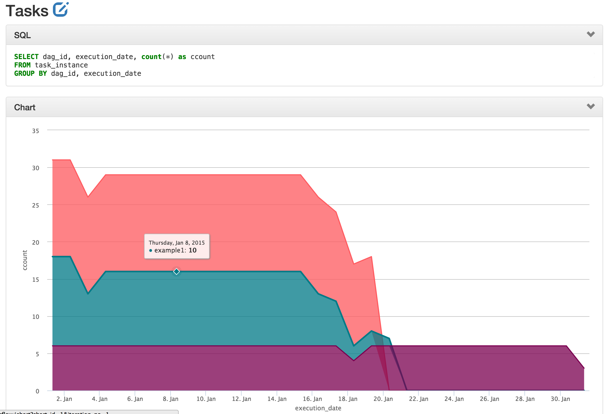
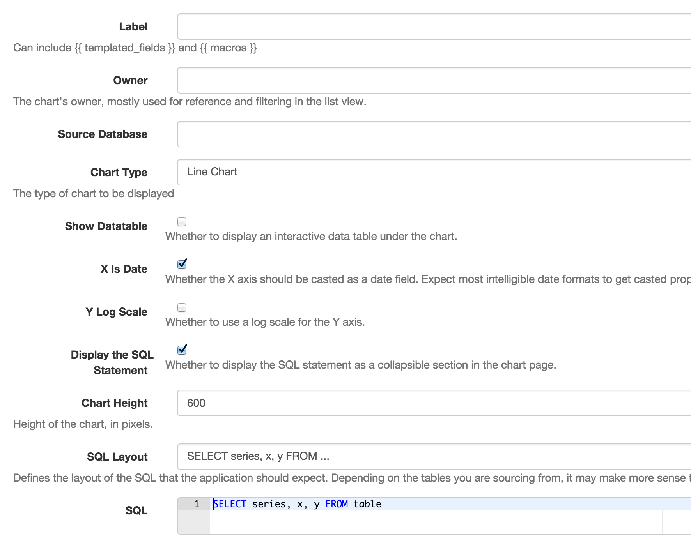

# 数据分析

用数据产生生产力的部分工作是使用合适的手段来分析你正在使用的数据。Airflow提供了简单的查询界面来书写SQL并快速获取结果，以及一个图表应用让数据可视化。

### 即席查询

即席查询界面允许用户通过已在Airflow中注册的数据库连接进行简单的SQL交互。

### 图表

一个构建在flask-admin和highcharts之上的简单界面让用户轻松地建立数据可视化和图表。做法是，在表单中天上标签、SQL、图表类型，从环境连接中挑拣源数据库，选择一些其他的选项，以及最后保存以备后用。

你甚至可以在编写Airflow工作流时使用相同的可用的模板和宏，同时参数化你的查询且直接在URL中修改参数。

这些图表虽然基础，但是易于创建、修改和分享。

#### 图表截图

#### 图表表单截图

