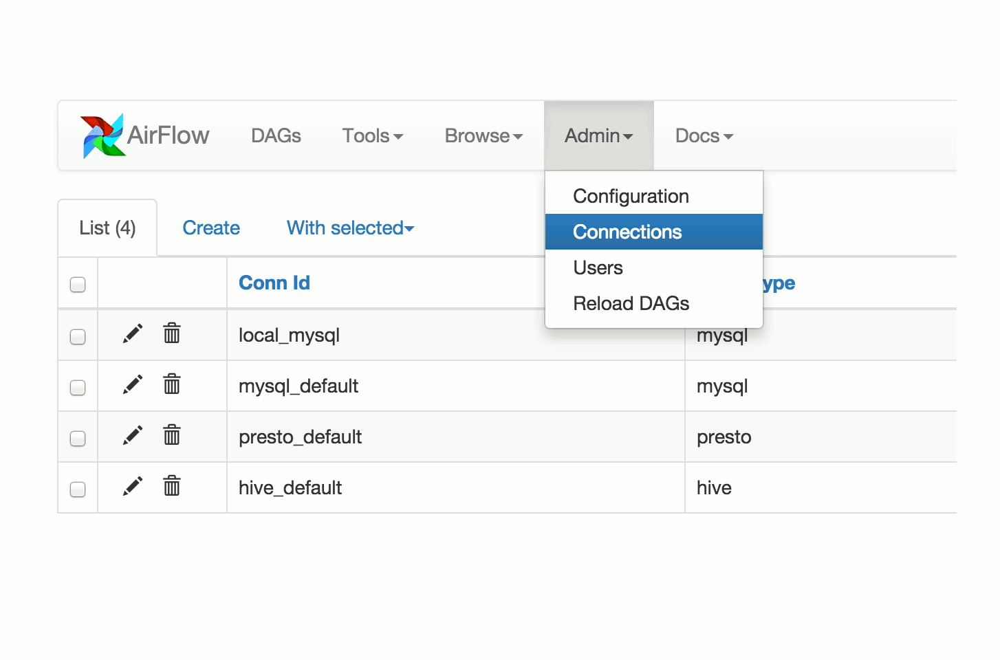

# 序言


**免责声明**：Apache Airflow是一个Apache软件基金会（ASF）孵化项目，由Apache孵化器赞助。 所有被ASF接受的新项目都要求先进行孵化，直到通过进一步的审查，表明该项目的基础设施、通信和决策过程已经稳定下来，与其他成功的ASF项目的稳定方式一致。 虽然孵化状态并不一定能反映代码的完整性和稳定性，但它确实表明该项目尚未得到ASF的完全认可。


Airflow是一个以编程方式来编辑、调度和监控工作流的平台。

使用Airflow来编辑工作流，创建任务（task）的有向无环图（directed acyclic graph， DAG）。Airflow调度程序依照指定的依赖，在一组工作节点（worker）上执行你的任务。丰富的命令行工具能够轻松地执行复杂的DAG图。丰富的用户界面使得在生成、监控进度、必要时候排除问题三个方面运行的管道（pipeline）的可视化变得容易。

当工作流用代码来定义时，它们就编程更加地可维护、可版本化、可测试与可协作。

## 原则

* **动态**：Airflow管道通过Python代码配置，并且允许动态生成管道。这使得写代码来动态实例化管道成为可能。
* **易扩展**：易于定义你的操作（operator）和执行（executor），并且可以扩展库以达到适配你的运行环境的水平。
* **优雅**：Airflow管道是简洁且易于理解的。通过引入强大的**Jinja**模板引擎，Airflow核心支持参数化脚本。
* **易伸缩**：Airflow具有模块化架构，并且使用消息队列来编排任任意数量的工作节点。Airflow的可伸缩性很强。

## Beyond the Horizon

Airflow**不是**数据流解决方案。数据不会从一个任务移动到另一个任务（虽然任务间可以交换元数据！）。Airflow不是在Spark Streaming或Storm所处的领域，它更能与Oozie或Azkaban相提并论。

希望工作流大多是静态的或缓慢变化的。你可以将工作流中的任务结构视为比数据库结构稍为动态的结构。希望Airflow工作流从这一次运行到下一次运行都是相似的，这样就能保证工作单元的清晰和工作流的连续性。

## 目录

* 项目
  * 历史
  * 提交者
  * 资源 & 链接
  * 路线图
* 许可
* 快速开始
  * 下一步做什么？
* 安装
  * 获取Airflow
  * 更多的Package
  * 初始化Airflow数据库
* 教程
  * 管道定义示例
  * 一个DAG定义文件
  * 导入模块
  * 实例化DAG
  * 任务
  * 用Jinja制作模板
  * 配置依赖
  * 重述要点
  * 测试
    * 运行脚本
    * 命令行元数据验证
    * 测试
    * 回填
  * 下一步做什么？
* 指南
  * 设置配置选项
  * 初始化数据库后端
  * 使用操作符
    * BashOperator
    * PythonOperator
    * Google Cloud Platform Operators
  * 管理连接
    * 使用UI创建连接
    * 使用UI编辑连接
    * 使用环境变量创建连接
    * 连接类型
  * 安全连接
  * 日志
    * 写日志到本地
    * 写日志到Amazon S3
    * 写日志到Azure Blob Storage
    * 写日志到Google Cloud Storage
  * 使用Celery扩展集群
  * 使用Dask扩展集群
  * 使用Mesos扩展集群
  * 使用systemd运行Airflow
  * 使用upstart运行Airflow
  * 使用测试模式配置
* UI / 快照
  * DAG视图
  * 树视图
  * 图视图
  * 变量视图
  * 甘特图
  * 任务时间视图
  * 代码视图
  * 任务实例上下文菜单
* 概念
  * 核心概念
    * DAG
    * 操作符
    * 任务
    * 任务实例
    * 工作流
  * 附加功能
* 数据描述
  * 即席查询
  * 图表
* 命令行界面
  * 位置参数
  * 子命令
* 调度 & 触发
  * DAG运行
  * 回填与Chatchup
  * 外部触发器
  * 牢记
* 插件
  * What for？
  * 为何构建在Airflow之上？
  * 接口
  * 示例
* 安全
  * Web身份验证
  * 多租户
  * Kerberos
  * OAuth身份验证
  * SSL
  * 模拟
* 时区
  * 概念
  * 时区感知DAG
* 实验性质的Rest API
* 集成
* 追踪
* FAQ
* API参考

