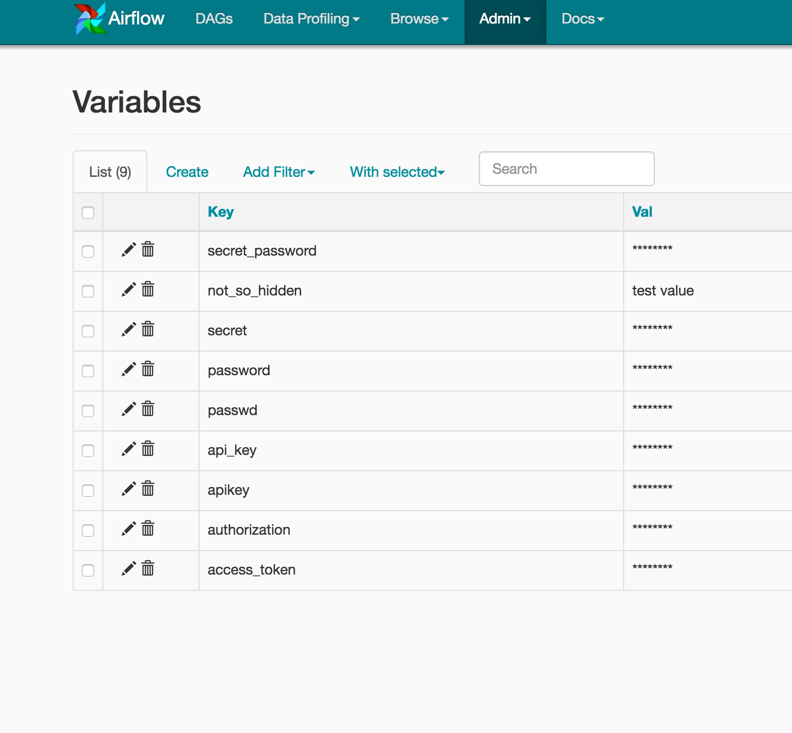
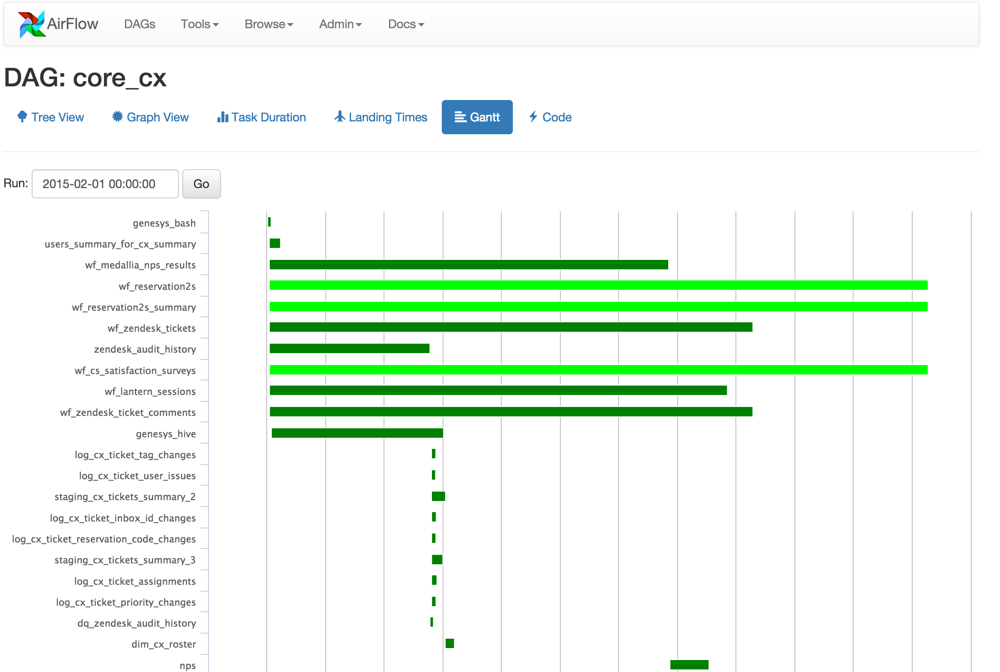

# UI/截图

Airflow UI使得数据管pipeline的监控和问题诊断变得更为方便。此文概述了你能在Airflow UI中找到的一些特性和可视化效果。

### DAGs视图

呈现了你的DAG列表，和一套指向实用页面的快捷图标。你可以一眼看到到底有多少任务已成功、失败或正在运行。

### Tree视图

呈现了横跨时间的DAG树形图。如果一个pipeline延迟了，你可以快速看到不同步骤运行到了哪里，并且识别出阻塞的步骤。

### Graph视图

Graph视图可能是最易理解的。它展示了DAG的任务依赖关系和它们在某次具体运行时的当前状态。

### 变量视图

变量视图允许你列出、创建、编辑或删除一个键值对，即作业中使用的变量。如果变量的键中包含（ ‘password’, ‘secret’, ‘passwd’, ‘authorization’, ‘api\_key’, ‘apikey’, ‘access\_token’）中的任一单词，变量的值默认会隐藏起来，但可以配置成明文显示。

### 甘特图

甘特图可以让你分析任务持续时间和重叠部分。你可以快速识别出瓶颈以及DAG某次运行的耗时之处。

### 任务持续时间

展示了过去N次运行中不同任务的持续时间。这个视图能让你发现异常情况并且快速掌握DAG多次运行的用时情况。

### 代码视图

透明即一切。虽然pipeline代码由源码控制，但是这个视图提供一种快速方式，能获取到生成DAG和提供上下文信息的代码。

### 任务实例上下文菜单

从上述的页面（tree视图、graph视图、甘特图……）出发，总能点击一个任务实例，进入其丰富的上下文菜单以获取更为详细的元数据，以及执行一些动作。

